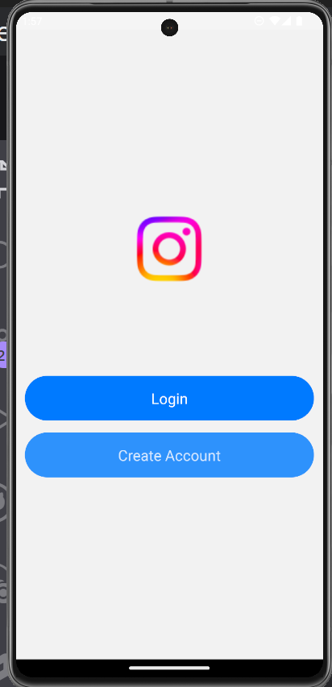
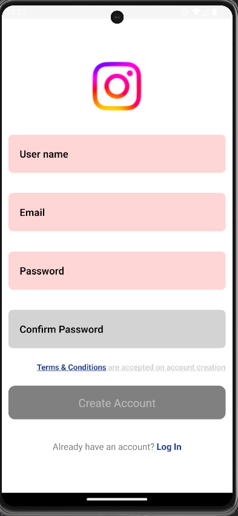
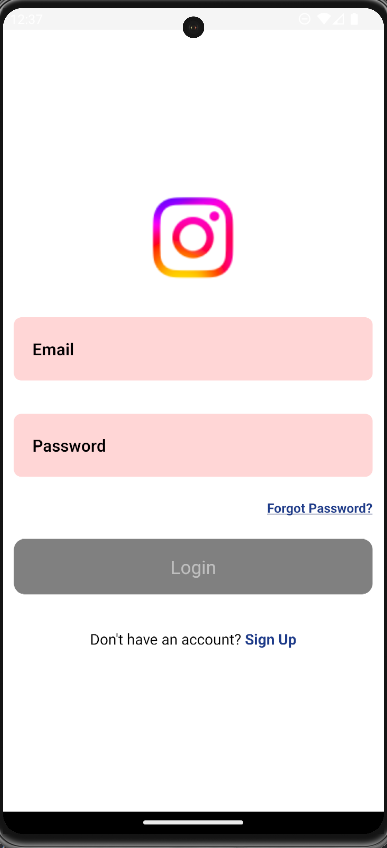
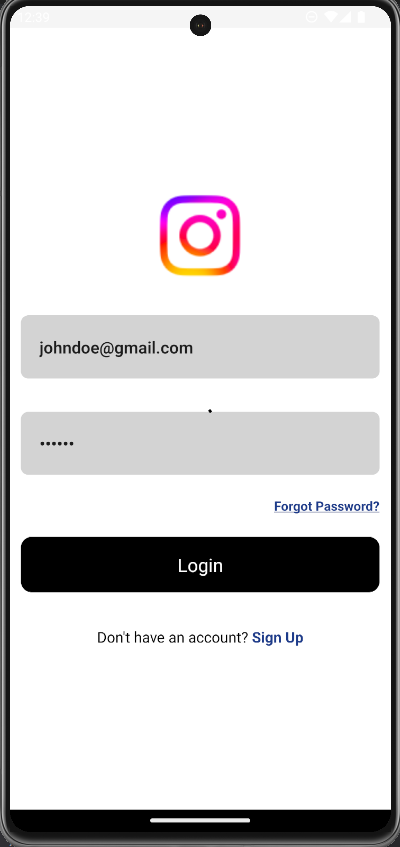
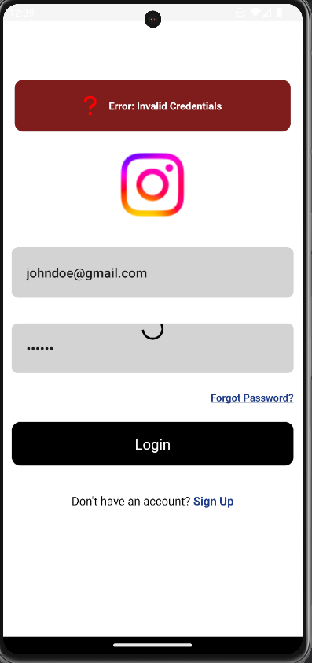
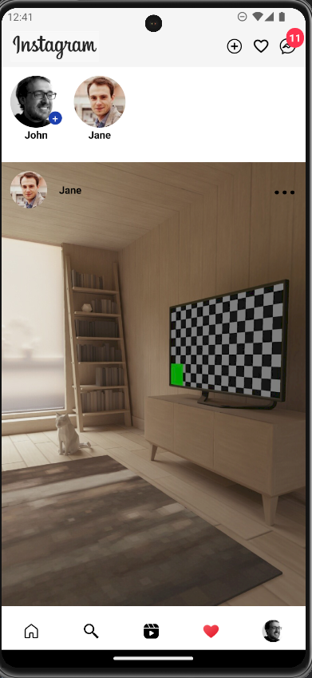
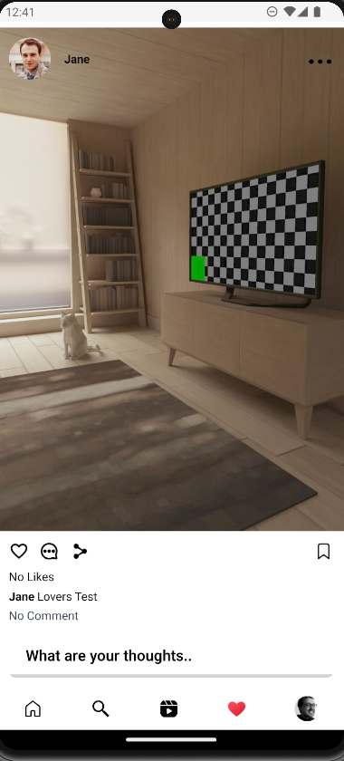
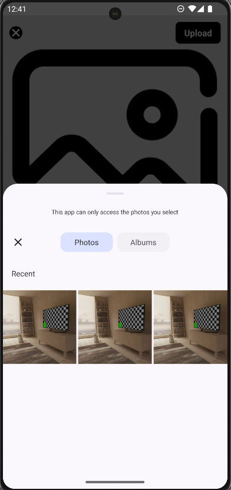
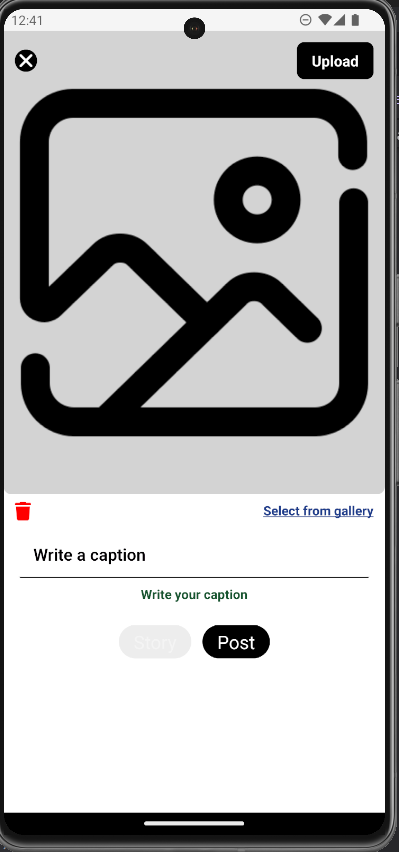
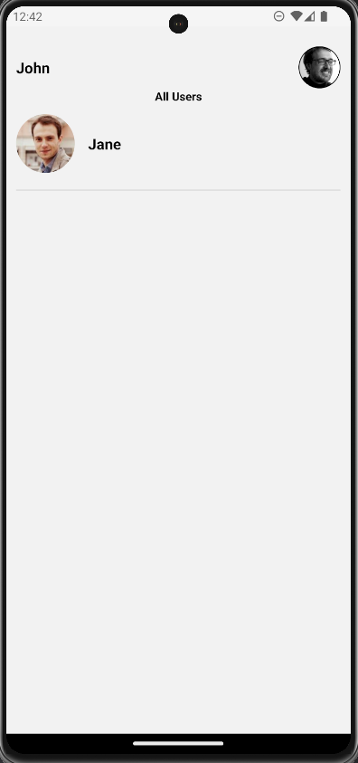

# Instagram with TypeScript React Native & Tailwind CSS

This is a new [**TypeScript React Native**](https://reactnative.dev) project, bootstrapped using [`nnoromiv rnTailwind`](https://github.com/nnoromiv/rnTailwind).

This is a instagram clone application that utilizes the [`Firebase`](https://www.firebase.google.com).

## Preview

### Welcome



### Sign Up



### LogIn



### LogIn Working



### Error Display



### Home



### Post



### Select Image



### Story


### Upload Post



### Messenger



## Getting Started

## Step 1: Clone Repository

```bash
   git clone https://github.com/nnoromiv/instagramClone.git
```

>**Note**: Make sure you have completed the [React Native - Environment Setup](https://reactnative.dev/docs/environment-setup) instructions till "Creating a new application" step, before proceeding.
>**Dependencies** Install all dependencies

```bash
   cd instagramClone
```

```bash
# using npm
   npm install

# OR using Yarn
   yarn add 
```

## Step 0: Create your `gradle.properties` file

Naturally auto generated react native structure contain this file but I `.gitignore` mine cause it hold Uploading Secrets.

- Navigate to the `android` folder.
- Create new file called `gradle.properties`
- Populate with the code below.

```gradle.properties
   # Project-wide Gradle settings.

   # IDE (e.g. Android Studio) users:
   # Gradle settings configured through the IDE *will override*
   # any settings specified in this file.

   # For more details on how to configure your build environment visit
   # http://www.gradle.org/docs/current/userguide/build_environment.html

   # Specifies the JVM arguments used for the daemon process.
   # The setting is particularly useful for tweaking memory settings.
   # Default value: -Xmx512m -XX:MaxMetaspaceSize=256m
   org.gradle.jvmargs=-Xmx2048m -XX:MaxMetaspaceSize=512m

   # When configured, Gradle will run in incubating parallel mode.
   # This option should only be used with decoupled projects. More details, visit
   # http://www.gradle.org/docs/current/userguide/multi_project_builds.html#sec:decoupled_projects
   # org.gradle.parallel=true

   # AndroidX package structure to make it clearer which packages are bundled with the
   # Android operating system, and which are packaged with your app's APK
   # https://developer.android.com/topic/libraries/support-library/androidx-rn
   android.useAndroidX=true
   # Automatically convert third-party libraries to use AndroidX
   android.enableJetifier=true

   # Use this property to specify which architecture you want to build.
   # You can also override it from the CLI using
   # ./gradlew <task> -PreactNativeArchitectures=x86_64
   reactNativeArchitectures=armeabi-v7a,arm64-v8a,x86,x86_64

   # Use this property to enable support to the new architecture.
   # This will allow you to use TurboModules and the Fabric render in
   # your application. You should enable this flag either if you want
   # to write custom TurboModules/Fabric components OR use libraries that
   # are providing them.
   newArchEnabled=false

   # Use this property to enable or disable the Hermes JS engine.
   # If set to false, you will be using JSC instead.
   hermesEnabled=true
```

## Step 1: Start the Metro Server

First, you will need to start **Metro**, the JavaScript _bundler_ that ships _with_ React Native.

To start Metro, run the following command from the _root_ of your React Native project:

```bash
# using npm
   npm start

# OR using Yarn
   yarn start
```

## Step 2: Start your Application

Let Metro Bundler run in its _own_ terminal. Open a _new_ terminal from the _root_ of your React Native project. Run the following command to start your _Android_ or _iOS_ app:

### For Android

```bash
# using npm
npm run android

# OR using Yarn
yarn android
```

### For iOS

```bash
# using npm
npm run ios

# OR using Yarn
yarn ios
```

## Step 3: Set Up your API & `.env`

Now that you have successfully run the app, let's modify it.

1. Navigate to [`Firebase`](https://www.firebase.google.com/).
2. Create an Account.
3. Create an application and follow each step.
4. Create a firebase.js file in your root directory

   ```js
      import { initializeApp } from "firebase/app";
      import { initializeFirestore } from "firebase/firestore";
      import { initializeAuth, getReactNativePersistence } from "firebase/auth";
      import ReactNativeAsyncStorage from '@react-native-async-storage/async-storage';

      const firebaseConfig = {
         apiKey: FIREBASE_API_KEY,
         authDomain: FIREBASE_AUTH_DOMAIN,
         projectId: FIREBASE_PROJECT_ID,
         storageBucket: FIREBASE_STORAGE_BUCKET,
         messagingSenderId: FIREBASE_MESSAGING_SENDER_ID,
         appId: FIREBASE_APP_ID,
         measurementId: FIREBASE_MEASUREMENT_ID
      };

      // Initialize Firebase
      const app = initializeApp(firebaseConfig);
      export const auth = initializeAuth(app, {
         persistence: getReactNativePersistence(ReactNativeAsyncStorage)
      })
      export const db = initializeFirestore(app, {
         experimentalForceLongPolling: true,
         useFetchStreams: false
      })
   ```

5. Go to [`ImgBB`](https://www.imgbb.com) - This Api is consumed to upload users images online.
6. Create a `.env` file in the folder directory
7. Populate your `.env` as follows.

```env
   BASE_URL='https://api.imgbb.com/1/upload'
   API_KEY=YOUR_IMGBB_API_KEY
   RANDOM_PHOTO='https://randomuser.me/api'
```

## Step 4: Using the Tailwind

```ts

   import tw from './tailwind'; // The import is relative to your file structure

   const MyComponent = () => (
   <View style={tw`p-4 android:pt-2 bg-white dark:bg-black`}>
      <Text style={tw`text-md text-black dark:text-white`}>Hello World</Text>
   </View>
   );

```

## Congratulations! :tada:

You've successfully run and modified your Instagram Clone. :partying_face:

### Now what?

- If you want to add this new React Native code to an existing application, check out the [Integration guide](https://reactnative.dev/docs/integration-with-existing-apps).
- If you're curious to learn more about React Native, check out the [Introduction to React Native](https://reactnative.dev/docs/getting-started).

## Troubleshooting React Native

If you can't get this to work, see the [Troubleshooting](https://reactnative.dev/docs/troubleshooting) page.

## Learn More about React Native

To learn more about React Native, take a look at the following resources:

- [React Native Website](https://reactnative.dev) - learn more about React Native.
- [Getting Started](https://reactnative.dev/docs/environment-setup) - an **overview** of React Native and how setup your environment.
- [Learn the Basics](https://reactnative.dev/docs/getting-started) - a **guided tour** of the React Native **basics**.
- [Blog](https://reactnative.dev/blog) - read the latest official React Native **Blog** posts.
- [`@facebook/react-native`](https://github.com/facebook/react-native) - the Open Source; GitHub **repository** for React Native.
